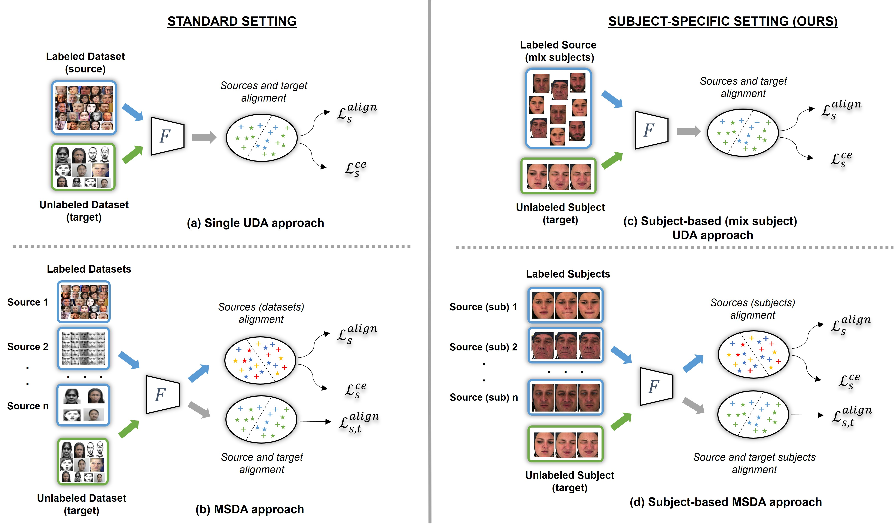
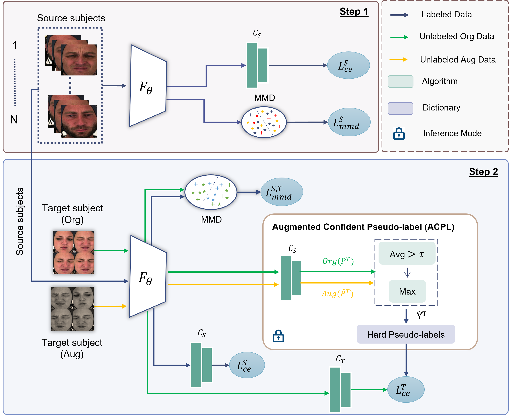

# Subject-Based Domain Adaptation for Facial Expression Recognition (FG2024)
Muhammad Osama Zeeshan<sup>1</sup>, Muhammad Haseeb Aslam<sup>1</sup>, Soufiane Belharbi<sup>1</sup>, Alessandro Lameiras Koerich<sup>1</sup>, Marco Pedersoli<sup>1</sup>, Simon Bacon<sup>2</sup>, Eric Granger<sup>1</sup>

<sup>1</sup>LIVIA, Dept. of Systems Engineering, ETS Montreal, Canada <br />
<sup>2</sup>Dept. of Health, Kinesiology & Applied Physiology, Concordia University, Montreal, Canada

# Domain Adaptation Setting
<p align="center">
  
</p>

# Subject-based MSDA
<p align="center">
  
</p>

# Installation

## Dependencies

### Using conda

```
conda create --name <env> --file <this file>
```


### Using pip

```
pip install -r req.txt
```


## Biovid Pain and Heat Dataset

```
Biovid datasets PartA can be downloaded from here: (https://www.nit.ovgu.de/BioVid.html#PubACII17)
```

## Training of Source Subjects and Adaptation to Target Domain

```
CUDA_VISIBLE_DEVICES=0 python methods/msbda.py --sub_domains_datasets_path=$BIOVID_DATASET_PATH --sub_domains_label_path=$BIOVID_DATASET_LABEL_PATH --pain_db_root_path=$BIOVID_ROOT_FOLDER_PATH
```

### Citation
```
@article{zeeshan2023subject,
  title={Subject-Based Domain Adaptation for Facial Expression Recognition},
  author={Zeeshan, Muhammad Osama and Aslam, Muhammad Haseeb and Belharbi, Soufiane and Koerich, Alessandro L and Pedersoli, Marco and Bacon, Simon and Granger, Eric},
  journal={arXiv preprint arXiv:2312.05632},
  year={2023}
}
```
